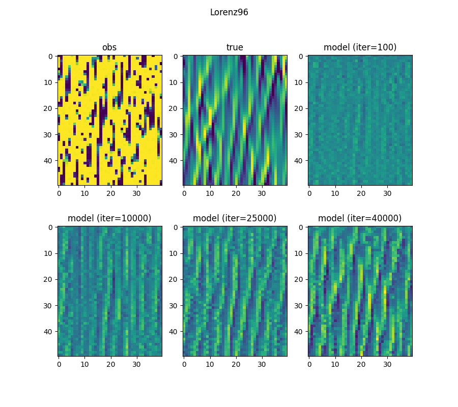
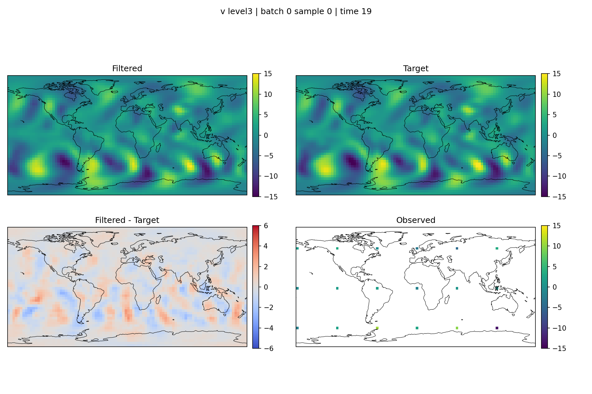

# DBF_SPEEDY
Deep Bayesian Filter (https://arxiv.org/abs/2405.18674) applied for an intermediate-level complexity atmospheric circulation model SPEEDY. 
The code assumes that the training and test data are already created in storage. For data generation, please see **pySPEEDY_data_generation** repository.

## Quick Lorenz-96 example

For a lightweight, self-contained demonstration of the Deep Bayesian Filter, the repository includes a Lorenz-96 setup that generates trajectories on the fly. The example uses simple 1D-convolutional encoder/decoder modules and does **not** require any pre-generated datasets.

Run a training session with the default configuration:

```bash
python train_lorenz96.py --config config/lorenz96_example.yaml
```

The configuration file illustrates how to compose experiments from modular dataset, encoder, decoder, and filter definitions. You can adjust sequence length, integration step size, network widths, and optimisation hyperparameters directly in the config file. Validation runs every `val_interval` training iterations (100 by default); tune this value in the `[train]` section to change how frequently metrics— including the reported RMSE between reconstructions and targets—appear in stdout.



## Example analysis

To reproduce the example analysis included in this repository, follow these steps:

1. Download the provided test data archives and unzip them into the repository.
2. Install the Python dependencies listed in `requirements.txt` (for example, with `pip install -r requirements.txt`).
3. Add the `DBF_SPEEDY` directory to your `PYTHONPATH` so the analysis scripts can import project modules.
4. Run the analysis script:

   ```bash
   python analyze/test_inference.py \
     --config config/decoder_transformer_dim2048_sparsest_Gaussian.yaml \
     --checkpoint trained_weight/model_dim2048.pt \
     --data-root test_data \
     --mean-root data_mean \
     --index-json index_test1.json \
     --device cuda \
     --rmse-dir test_rmse
   ```

   Adjust the `--device` argument if you prefer to run on CPU or a different CUDA device.

### Inference example

The example below summarises the filtered state produced by the analysis script, alongside the target fields and observations for the same sample.

